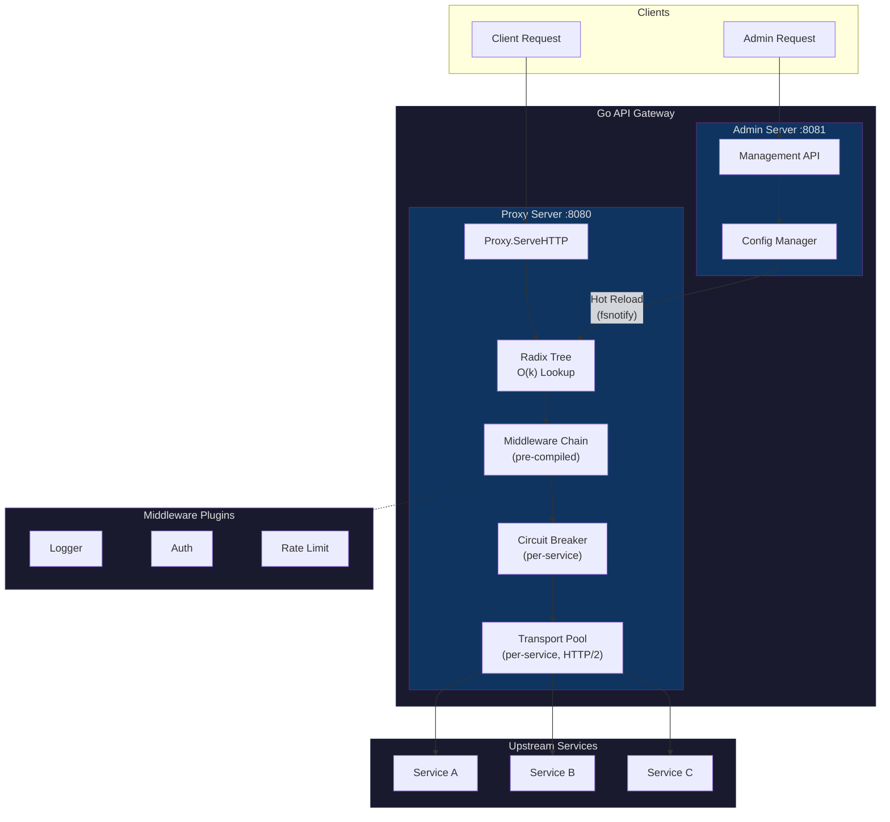
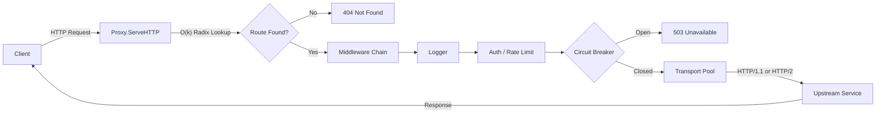
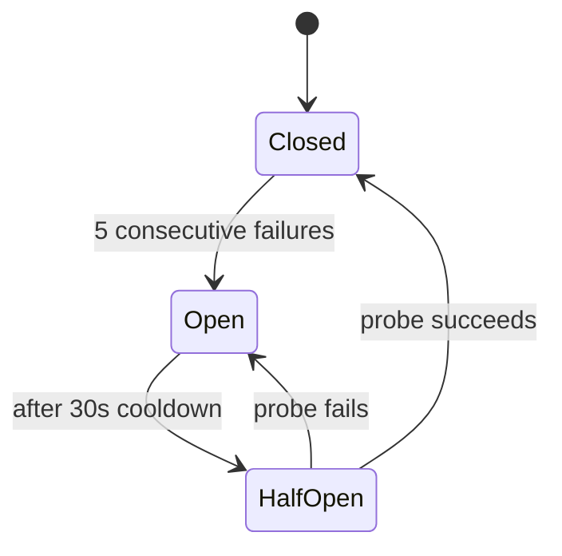

# Go API Gateway

A lightweight, high-performance API Gateway written in Go. Designed for production workloads with zero-allocation routing, per-service circuit breakers, and hot-reload configuration.

## Architecture



### Request Flow



### Circuit Breaker State Machine



### Config Hierarchy

Plugins are resolved in order of specificity. Route-level overrides service-level, which overrides global:

```
Global Plugins → Service Plugins → Route Plugins
   (lowest)         (middle)         (highest priority)
```

## Features

| Feature | Description |
|---------|-------------|
| **Radix Tree Routing** | Zero-allocation O(k) path lookup with param (`:id`) and wildcard (`*path`) support |
| **Circuit Breaker** | Lock-free fast path, per-service state machine (Closed → Open → HalfOpen) |
| **Connection Pooling** | Per-service HTTP transport with configurable pool sizes and HTTP/2 support |
| **Plugin System** | Composable middleware — pre-compiled at config load, zero alloc per-request |
| **Hot Reload** | Config changes via fsnotify trigger atomic route table swap (no downtime) |
| **Management API** | Full CRUD REST API for upstreams, services, routes, and plugins |
| **Duplicate Detection** | Route conflict validation at config, management API, and radix tree layers |

## Project Structure

```
go-api-gateway/
├── cmd/api-gateway/          # Application entry point
├── configs/config.yaml       # Gateway configuration
├── internal/
│   ├── config/               # Config manager, CRUD, hot-reload (fsnotify)
│   │   ├── config.go         # Struct definitions (Upstream, Service, Route)
│   │   ├── loader.go         # YAML loading & file watcher
│   │   ├── route.go          # Route CRUD with conflict detection
│   │   └── *_test.go         # Unit tests
│   ├── gateway/              # Core gateway engine
│   │   ├── proxy.go          # HTTP handler (ServeHTTP), atomic route snapshot
│   │   ├── radix.go          # Radix tree: Insert, Search, wildcard, params
│   │   ├── routing.go        # Route table builder, middleware chain compiler
│   │   ├── transport.go      # Per-service HTTP transport pool + circuit breaker wrapper
│   │   ├── circuit_breaker.go # Thread-safe state machine (lock-free hot path)
│   │   ├── plugin.go         # Plugin registry and interface
│   │   └── server.go         # Dual-server bootstrap (proxy + admin)
│   ├── handler/              # Management API handlers (REST CRUD)
│   ├── middleware/            # Built-in plugins
│   │   ├── auth.go           # JWT / API key authentication
│   │   ├── ratelimit.go      # In-memory rate limiting
│   │   └── logger.go         # Structured request logging
│   ├── domain/               # DTOs and request/response models
│   └── helper/               # JSON response helpers
├── mock-server/              # Mock upstream for testing
├── performance/              # K6 load test scripts
├── Dockerfile                # Multi-stage production build
└── docker-compose.yml        # Gateway + mock server + K6
```

## Quick Start

### Prerequisites

- Go 1.21+
- Docker & Docker Compose (optional)

### Run Locally

```bash
# Clone & install
git clone https://github.com/haiser1/go-api-gateway.git
cd go-api-gateway
go mod tidy

# Development (with hot reload)
make run-dev

# Production build
make build && make run
```

### Run with Docker

```bash
# Start gateway + mock server
docker compose up -d api-gateway mock-server

# View logs
docker compose logs -f api-gateway

# Stop
docker compose down
```

## Configuration

The gateway is configured via `configs/config.yaml`. Changes are detected automatically via fsnotify and applied without restart.

```yaml
server:
  proxy_port: 8080      # Public traffic
  admin_port: 8081      # Management API
  log_level: info

global_plugins:
  - name: logger
    enabled: true
    config:
      format: json

upstreams:
  - id: upstream-backend
    name: backend-upstream
    algorithm: round-robin        # round-robin | least-conn | random
    targets:
      - host: backend-service
        port: 8000
        weight: 100
        health_check:
          path: /health
          interval: 10s

services:
  - id: svc-backend
    name: backend-service
    upstream_id: upstream-backend  # Links to upstream above
    protocol: http
    timeout: 30                   # Total request timeout (seconds)
    connect_timeout: 10           # TCP connection timeout
    read_timeout: 30              # Response header timeout
    retries: 3                    # Retry on failure
    retry_backoff: 1.5            # Exponential backoff multiplier
    plugins:
      - name: authorization
        enabled: true
        config:
          type: jwt

routes:
  - id: route-users
    name: user-api
    methods: [GET, POST, PUT, DELETE]
    paths:
      - /api/v1/users
      - /api/v1/users/:id
    service_id: svc-backend
    strip_prefix: false
    plugins:
      - name: rate-limiting
        enabled: true
        config:
          requests_per_minute: 100
```

## Management API

REST API on the admin port (default `:8081`) for runtime configuration.

### Upstreams

| Method | Endpoint | Description |
|--------|----------|-------------|
| `GET` | `/api/upstreams` | List all upstreams |
| `POST` | `/api/upstreams` | Create upstream |
| `GET` | `/api/upstreams/:id` | Get upstream details |
| `PUT` | `/api/upstreams/:id` | Update upstream |
| `DELETE` | `/api/upstreams/:id` | Delete upstream |

### Services

| Method | Endpoint | Description |
|--------|----------|-------------|
| `GET` | `/api/services` | List all services |
| `POST` | `/api/services` | Create service |
| `GET` | `/api/services/:id` | Get service + routes |
| `PUT` | `/api/services/:id` | Update service |
| `DELETE` | `/api/services/:id` | Delete service |

### Routes

| Method | Endpoint | Description |
|--------|----------|-------------|
| `GET` | `/api/routes` | List all routes |
| `POST` | `/api/routes` | Create route |
| `GET` | `/api/routes/:id` | Get route details |
| `PUT` | `/api/routes/:id` | Update route |
| `DELETE` | `/api/routes/:id` | Delete route |

### Plugins

| Method | Endpoint | Description |
|--------|----------|-------------|
| `GET` | `/api/global-plugins` | List global plugins |
| `POST` | `/api/global-plugins` | Add global plugin |
| `PUT` | `/api/global-plugins/:name` | Update global plugin |
| `DELETE` | `/api/global-plugins/:name` | Delete global plugin |
| `GET` | `/api/services/:id/plugins` | List service plugins |
| `POST` | `/api/services/:id/plugins` | Add plugin to service |
| `GET` | `/api/routes/:id/plugins` | List route plugins |
| `POST` | `/api/routes/:id/plugins` | Add plugin to route |

## Performance

The gateway is designed for high throughput with minimal overhead:

| Component | Performance |
|-----------|------------|
| Static route lookup | ~153 ns/op, **0 allocs** |
| Parameterized route lookup | ~377 ns/op, 2 allocs |
| Wildcard route lookup | ~440 ns/op, 2 allocs |
| Circuit breaker (hot path) | Lock-free atomic check |
| Transport pool | 500 idle conns, 100/host, HTTP/2 enabled |

```bash
# Run benchmarks
go test -bench=. -benchmem ./internal/gateway/

# Run K6 load test
make k6-test
```

## Makefile Commands

```bash
make run-dev       # Development mode (go run)
make build         # Build production binary
make run           # Run production binary
make test          # Run all tests

make docker-up     # Start containers
make docker-down   # Stop containers
make docker-build  # Rebuild images
make docker-logs   # Tail container logs
make docker-stats  # Container resource usage
make docker-ps     # Container status
make docker-clean  # Prune unused resources

make k6-test       # Run K6 load tests
make log-analytics # Log level analytics
```

## Roadmap

- [ ] **CORS Plugin** — Configurable cross-origin headers
- [ ] **Redis Rate Limiting** — Distributed rate limiting for cluster environments
- [ ] **gRPC Support** — gRPC proxying and protocol translation
- [ ] **WebSocket Support** — Persistent WebSocket connection proxying
- [ ] **Prometheus Metrics** — Built-in `/metrics` endpoint for monitoring
- [ ] **Service Discovery** — Consul / etcd integration for dynamic registration
- [ ] **Advanced Load Balancing** — Least connections, weighted round-robin strategies
- [ ] **Request Transformation** — Header/body modification plugins

## License

MIT License — see [LICENSE](LICENSE)
